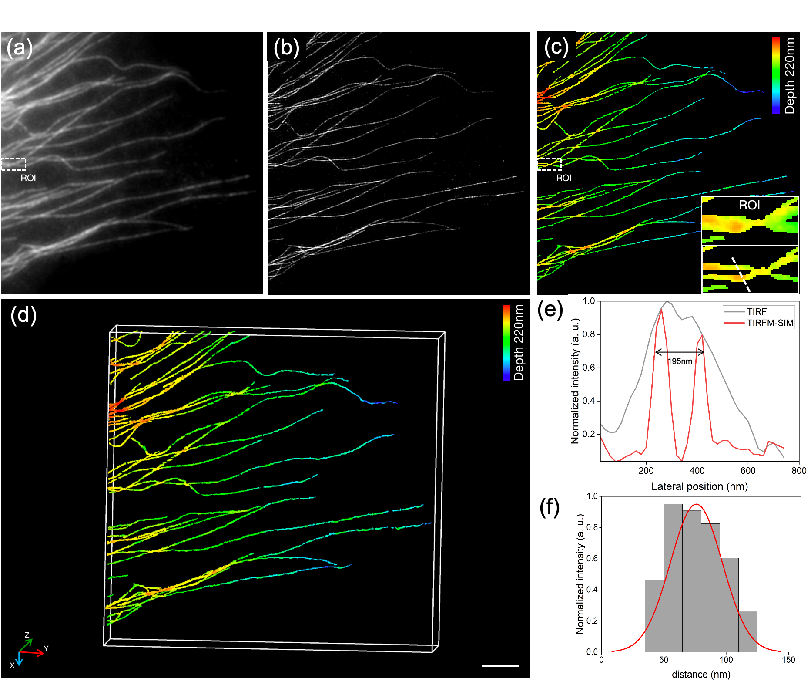

# Alternative method to enhance the axial resolution of total internal reflection fluorescence structured illumination microscopy
XiuZheng, Xiaomian Cai, Cuifang Kuang, Youhua Chen and Wenjie Liu.
 

**Abstract**

Total internal reflection fluorescence structured illumination microscopy (TIRF-SIM) can enhance the lateral resolution of fluorescence microscopy to twice the diffraction limit, enabling subtler subcellular life activity observation. However, the lack of axial resolution makes it difficult to resolve three-dimensional (3D) subcellular structures. In this paper, we present an alternative TIRF-SIM axial resolution enhancement method by exploiting quantitative information regarding the distance between fluorophores and the surface within the evanescent field. Combining the lateral super-resolution information of TIRF-SIM with reconstructed axial information, the 3D super-resolution image with a 50-nm axial resolution is achieved without attached special optical components or high-power lasers. The reconstruction results of cell samples demonstrate that the axial resolution enhancement method for TIRF-SIM can effectively resolve the axial depth of densely structured regions.
## Getting started
- This is the open source data from the paper. 
- **main.m** contains the entire flow of Figure 1c from the paper.
- The run results are consistent with Figure 4 in the paper.

